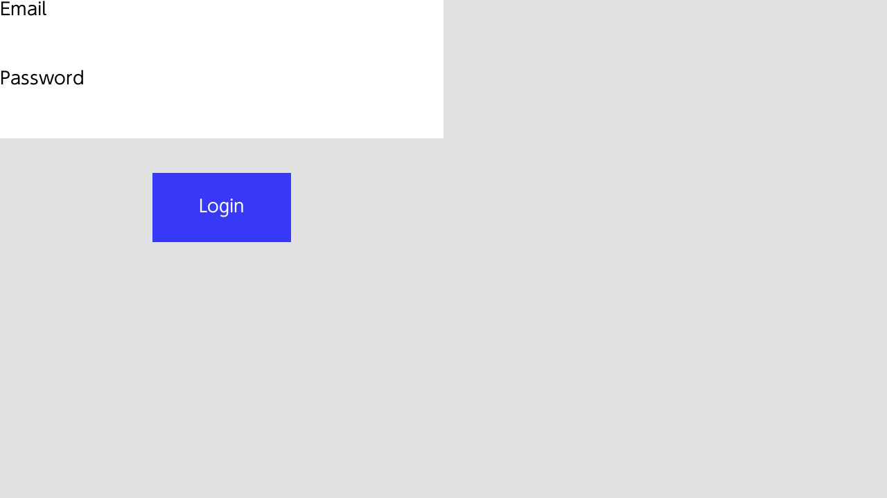
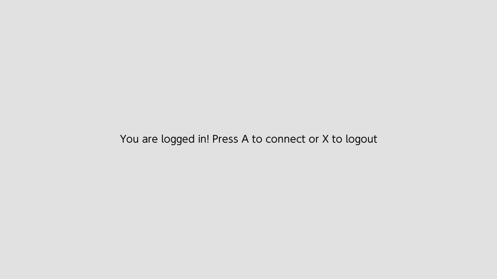
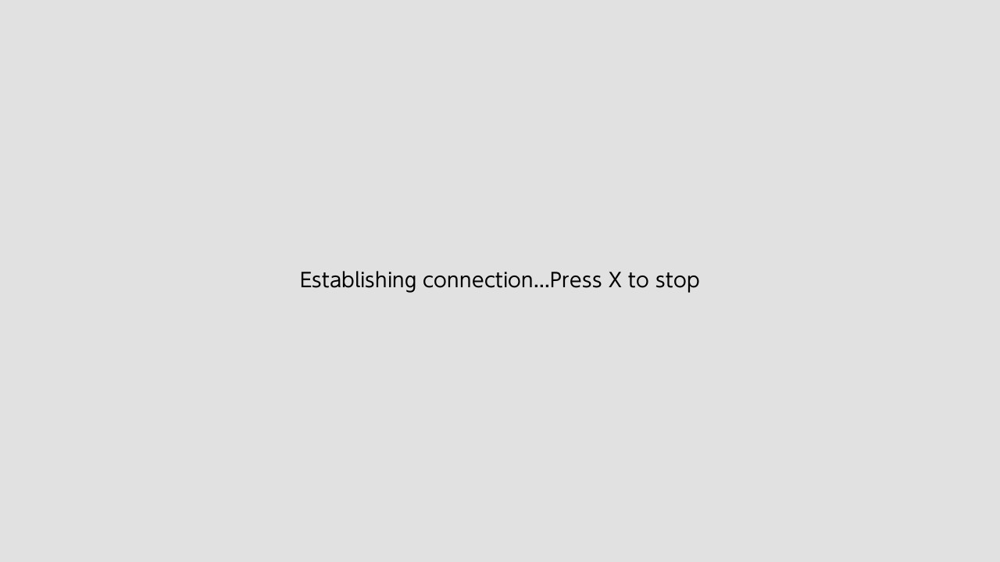
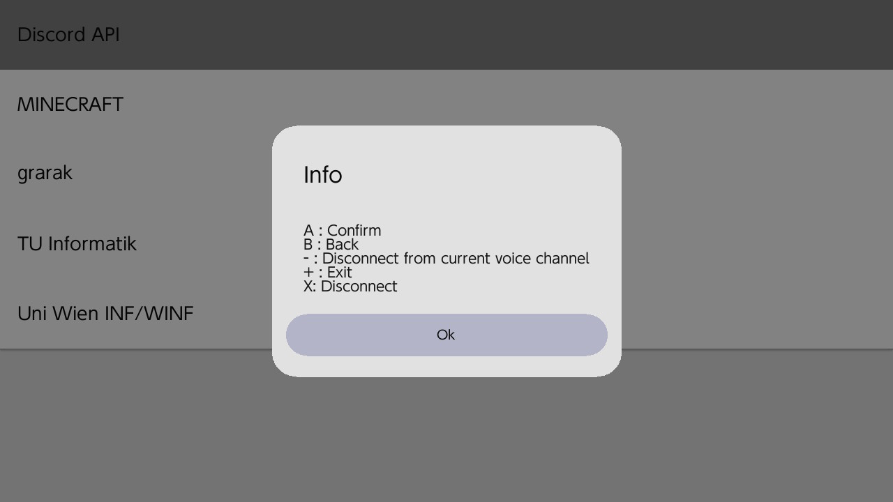
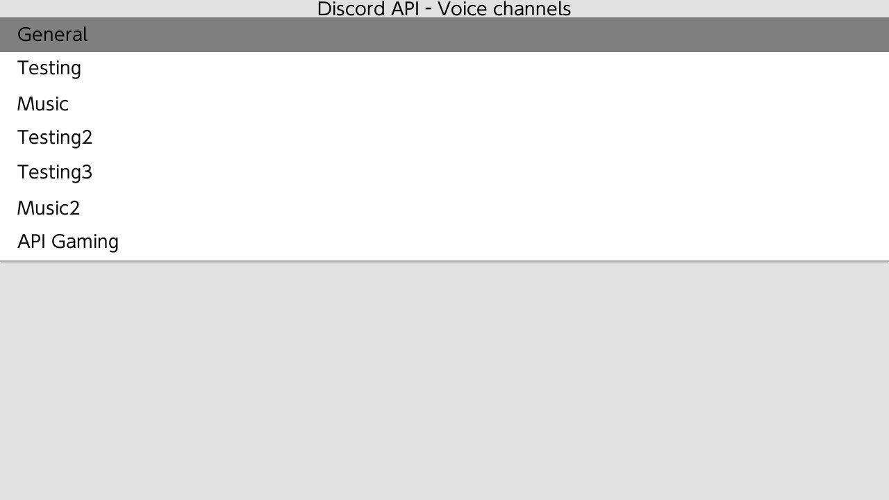

# NXCord
[](https://github.com/Grarak/NXCord/blob/master/LICENSE)
[](https://github.com/Grarak/NXCord/releases)
[](https://github.com/Grarak/NXCord/releases)
[](https://app.fossa.io/projects/git%2Bgithub.com%2FGrarak%2FNXCord?ref=badge_shield)
[](https://github.com/Grarak/NXCord/actions)

## Unofficial Nintendo Switch Discord client
Discord's TOS forbids the use of third party clients, thus use at your own risk! Also a lot of code has been taken from
https://github.com/yourWaifu/Unofficial-Discord-3DS-Client, so thanks a lot for yourWaifu's 3ds client.



## Installation and usage
Download the latest build from [Releases](https://github.com/Grarak/NXCord/releases). Extract it to the root of your
sdcard you use for your switch. You do need to reboot your system, otherwise the sysmodule won't start running. After
rebooting you can open NXCord in homebrew menu and you will see a login screen, if it's your first time using it.

### Using a bot
Since selfbotting is not allowed, I'd recommend you to use a bot. If you don't know how to do it, just follow these
[simple steps](https://github.com/reactiflux/discord-irc/wiki/Creating-a-discord-bot-&-getting-a-token). After copying
the token and inviting the bot to your desired discord server, create a file named ```/config/nxcord/nxcord.ini``` and
put your token there. For example your first line in the file should be ```token=<your token>```. You need to restart
your switch after modifying that file.

### Selfbotting
Selfbotting means that you are using a third party client to access discord with an user account. It's against the TOS of
discord, thus not recommended. I've been using an user account for testing for months already and haven't been banned yet.
Might be safe, but I am not responsible for any bans!

## Limitations and bugs
Because this whole application is actually running in the background as a custom sysmodule, there are memory restrictions.
Discord is a memory hog, thus you will hit the memory limit of Atmosphere rather quickly. Even the login process alone, can
take up to 20MiB. Fetching channel information of big discord servers will probably crash your switch. So if you ever see the
sysmodule crashed screen, you will have to use a different account/bot. I'd recommend you to only join one or two not so
busy servers.

If you don't really care about the sysmodule aspect of this project you can also use the
[standalone client](https://github.com/Grarak/NXCord/actions) version. It won't run in the background and you can use a
discord account as big as you like.

Also right now a lot of features are missing. Head over to [projects](https://github.com/Grarak/NXCord/projects) to see
what possible features are planned for the future.

### Microphone
The switch itself doesn't have any external microphones, so you do need to plug in headphones/earbuds to actually utilise
speaking.

### Tesla overlay
Right now there are two bugs.
- When you open NXCord in the overlay menu, the overlay itself will disappear. Just reopen it.
- Voice channel won't refresh by itself when participants join or leave. Press B and reopen to manually refresh.

## Building NXCord

### Dependencies
For building you need to install dependencies first.

Assuming you have devkitpro and libnx installed, just run:
```
$ (dkp-)pacman -S switch-libsodium switch-mbedtls switch-zlib switch-sdl2 \
  switch-sdl2_ttf switch-sdl2_image switch-sdl2_gfx switch-sdl2_mixer \
  switch-mesa switch-glad switch-glm switch-libdrm_nouveau switch-libwebp \
  switch-libpng switch-freetype switch-bzip2 switch-libjpeg-turbo switch-opusfile \
  switch-libopus
```
```
$ git clone --recurse-submodules git@github.com:Grarak/NXCord.git
$ cd NXCord
$ mkdir build
$ cmake -DCMAKE_TOOLCHAIN_FILE=../DevkitA64Libnx.cmake ..
$ make
```

### Build options
There are several different build variants:
- Client without IPC:
```
$ cmake -DCMAKE_TOOLCHAIN_FILE=../DevkitA64Libnx.cmake -DENABLE_CLIENT_STANDALONE=ON ..
```
- Sysmodule without IPC:
```
$ cmake -DCMAKE_TOOLCHAIN_FILE=../DevkitA64Libnx.cmake -DENABLE_SYSMODULE_APPLICATION=ON ..
```

## License
[](https://app.fossa.io/projects/git%2Bgithub.com%2FGrarak%2FNXCord?ref=badge_large)
